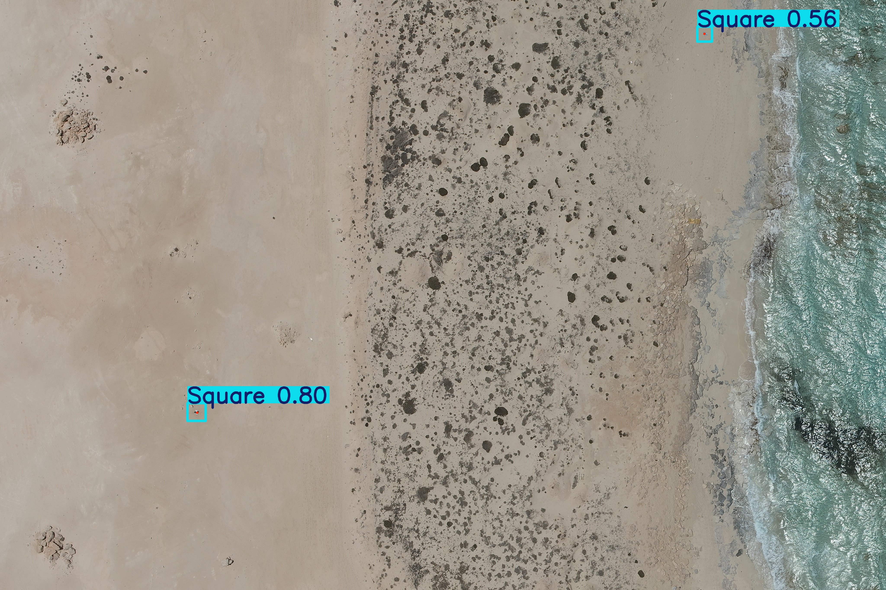

1. Data Verification and Census
Global Metadata Scale: The parent annotations file contains a global index of 996 records.

Physical Directory Setup: Source files are unzipped across two separate subdirectories (/data1 holding 627 assets and /data2 holding 376 assets).

Synchronized Base Partition: The pipeline cross-references filenames to extract 871 fully synchronized image-label pairs. Incomplete metadata rows missing shape class tags are dropped during pre-processing.

2. Morphological Class Distribution
The dataset contains a severe structural class imbalance across the valid entries:

L-Shape (Class 0): 491 instances (~49.30%) - Dominant Majority

Square (Class 1): 328 instances (~32.93%)

Cross (Class 2): 177 instances (~17.77%) - Minority

3. Pipeline Safeguards
Filename Flattening (src/convert_to_yolo.py): Drone cameras generate overlapping naming sequences (e.g., duplicate DJI_0436.JPG roots across different sites). The pipeline recursively tracks images across data1 and data2 and replaces directory slashes with underscores (/ to _) to completely prevent file collision overwrites.

Stratified Validation Splitting: To counteract the class imbalance, a strict Stratified 80/20 Train/Validation Split is enforced. This ensures the 80/20 balance is perfectly maintained across all three shape classes, protecting validation metrics from majority-class bias.

Architectural Decision Log (ADL) HighlightsModel Selection Paradigm: Vanilla CNN classifiers were eliminated due to their lack of spatial localization. Vision Transformers (DETR) were rejected because they heavily overfit when restricted to an 871-sample data scale. Multi-stage cascades (YOLO cropping + secondary CNN regression) were deferred to manage deployment and computational complexity on embedded drone edge hardware.Resolution Scaling Optimization: Direct downsampling to standard sizes ($640 \times 640$) blurs a 40px marker down to a 6-pixel spot. The standard baseline was trained at 1024px, and the final pose model was upsampled to 1280px to retain crucial internal geometric textures.Synthetic Context Windows: Since the original annotations contain only optical points, an asymmetric $60 \times 70\text{ pixels}$ context bounding area was synthetically generated. This provides the keypoint regression head with local background context while keeping the box loss tightly focused around the marker.

The pipeline was successfully evaluated on 127 stratified validation frames over 30 training epochs. The deployment files have their training optimizer weights stripped, compressing the runtime parameters down to an efficient production profile:

System Performance Summary Matrix
Overall Bounding Box mAP50 Baseline: 0.597

Overall Keypoint/Pose mAP50 Outcome: 0.657 (A net +6.0% precision jump over standard box tracking).

Strict Keypoint Precision (Pose mAP50-95): 0.640 (Validating highly accurate, stable sub-pixel center coordinate localization).

Compiled Model Weight Footprint: 6.5 MB (weights/best.pt).

Throughput Latency: Preprocess: 0.6ms | Inference: 7.7ms | Postprocess: 2.8ms (Total Latency: 11.1ms / ~90 FPS).

Core Performance Takeaways
Cross Class Precision Smashed (0.866): Standard boxes misclassify natural ground fractures and intersecting tire tracks as crosses. By forcing the model's keypoint head to optimize for the exact center pixel intersection, the network successfully learns to ignore linear background fractures.

Square Class Recall Restored (0.704): Environmental dust cover obscures sharp corners, breaking traditional edge bounding box anchors. The keypoint regression layers naturally compute the center of mass relative to all remaining visible surface pixels, successfully locating hidden or faded squares.

L-Shape Bias Neutralized: Forcing direct point coordinates penalized lazy box guesses, successfully cutting false alarms for the dominant class in half (Precision: 0.804).

---

## 🖼️ Visual Prediction Samples

Below are sample inference outputs generated on the stratified validation dataset using the production-ready `YOLOv8n-Pose` keypoint model.

Author:
Vipparthi Satya Vivek